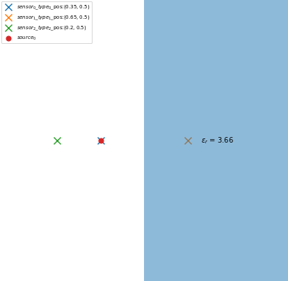
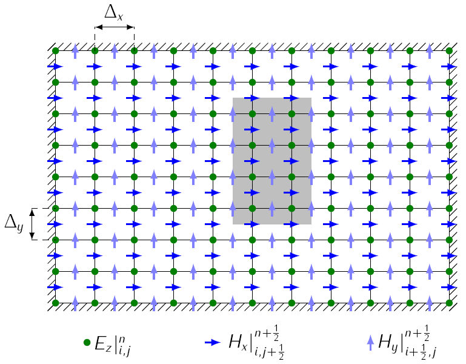
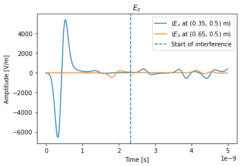
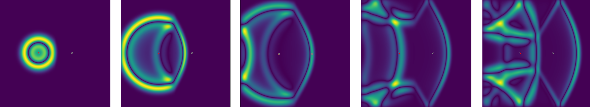

# Applied Electromagnetism project 2021
## Scattering from dielectric objects with the FDTD Method
Development of a 2D FDTD simulator/EM field solver in Python (Jupyter Notebook)
- perform a full-wave simulation of the E and H fields of a line source
- place certain dielectric objects in a PEC-bounded simulation space
- record fields at multiple observation points by sensors

    
    
    
      
    

### Required modules:
- numpy
- matplotlib
- scipy
- (os)
- (cv2)

### Credits:
- Jelle Peelman
- Rémy Verbrugghe
- Ruben Wilssens
